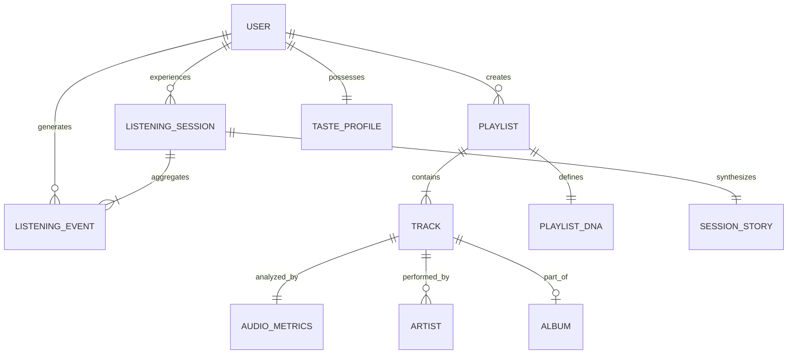

# MooSic — Product Specification & UX Architecture Document
**Posição:** Principal Product Designer, UX Strategist & Product Architect  
**Versão:** 2.0 (Evolução de Sessão e DNA Musical)  
**Status:** Aprovado para Roadmap de Engenharia e Design  

---

## 1. PRODUCT VISION

> **"O MooSic não é um catálogo infinito de arquivos sonoros. O MooSic é um observador sensível de momentos humanos traduzidos em música."**

As plataformas convencionais (Spotify, Apple Music, YouTube Music) tratam a música como **commodities transacionais**: listas estáticas de faixas indexadas por métricas de popularidade e contadores frios de streams. Elas registram *o que* você clicou, mas são cegas para *como* e *por que* você escutou.

A filosofia do MooSic inverte essa premissa:
1. **A unidade fundamental de música não é a faixa isolada; é a Sessão de Escuta.**
2. **A playlist não é uma pasta de links; é uma narrativa sonora com progressão, tensão e DNA mensurável.**
3. **O histórico do usuário não é um log de auditoria; é a cartografia da sua identidade e dos seus estados de espírito.**

O MooSic transforma dados em poesia visual e arquitetura de áudio de alta precisão. Ele não gamifica de forma infantil, não cria bolhas estáticas e não tenta adivinhar a psicologia do usuário com algoritmos opacos: ele oferece **transparência compreensível**, dando ao ouvinte o espelho mais sofisticado e autêntico do seu próprio hábito musical.

---

## 2. FEATURE MAP & TAXONOMIA DE PRODUTO

```text
                                  ┌────────────────────────┐
                                  │   MOOSIC ECOSYSTEM     │
                                  └───────────┬────────────┘
                                              │
         ┌──────────────────┬─────────────────┼─────────────────┬──────────────────┐
         │                  │                 │                 │                  │
         ▼                  ▼                 ▼                 ▼                  ▼
  [CORE PLAYBACK]     [SESSION & DNA]    [PLAYLIST ENG.]    [DISCOVERY LAB]    [TASTE CARTOGRAPHY]
  • Global Player     • Listening Sess.  • Playlist DNA     • Smart Queue      • Music DNA
  • Biquad 3D Spatial • Session Story    • Playlist Flow    • Surprise Roulette• Music Map
  • Binaural Resonator• Dynamic Ambient  • Cover Studio     • Mood Mixing      • Music Journey
  • Hi-Res Engine     • Why You Love It  • Collab. Blend    • Contextual Rec.  • Day In Music
```

### Categorias Detalhadas:
* **Pilar A: Core Playback & Audio Engine**: Player de alta fidelidade persistente, suporte a áudio espacial 3D via Web Audio API, síntese harmônica paralela (MooSic Resonator 432Hz/528Hz/Brown Noise/Alpha 10Hz) e sincronização elástica de letras.
* **Pilar B: Session Intelligence**: Detecção automática de início, ascensão, pico, desaceleração e encerramento de sessões (`ListeningSession`), cálculo de energia média e narrativa editorial retroativa (*"Sua sessão teve uma história"*).
* **Pilar C: Playlist Engineering**: Modelagem de DNA de listas (*Energy, Danceability, Atmosphere, Mood, Acoustic, Vocal, Tempo*), progressão de fluxo (*Intro → Build → Peak → Cruise → Outro*) e Playlist Cover Studio paramétrico.
* **Pilar D: Discovery & Smart Queue**: Fila preditiva transparente (*"Por que essa música?"*), Discovery Roulette com 4 níveis de entropia (*Familiar, Curious, Experimental, Wild*) e Mood Mixing combinatório.
* **Pilar E: Taste Cartography**: Perfil analítico autêntico (*The Night Explorer, The Album Devotee*), mapa vetorial de proximidade sonora e linha do tempo histórica de mutação de gostos (*Music Journey*).

---

## 3. USER JOURNEYS (EXPERIÊNCIAS DE PONTA A PONTA)

### Jornada 1: O Ouvinte Noturno em Fluxo (Listening Session)
1. **Entrada:** Às 23:15, Victor conecta seus fones de ouvido e dá Play em uma faixa de R&B contemporâneo. O MooSic detecta um novo *Session Event Boundary*.
2. **Imersão:** O fundo escuro (`#07080B`) extrai suavemente o pigmento dominante violeta-azulado da capa, adaptando o brilho das bordas com transições aveludadas de 1200ms.
3. **Evolução:** Ao longo de 1h20, Victor ouve 14 músicas. Ele pula uma faixa aos 8 segundos (registrado como *Skip Rápido*) e ouve três faixas consecutivas de Hip-Hop até o fim.
4. **Fechamento:** Victor pausa a música à 00:35. Ao reabrir o player no dia seguinte, a tela inicial exibe um card editorial discreto:  
   *"Sua sessão de ontem teve uma narrativa: 23:15 (Chill) → 23:45 (Pico de Energia 84%) → 00:20 (Atmosférico). 1h20m de imersão."*

### Jornada 2: A Curadoria Autoral (Playlist DNA & Flow)
1. **Criação:** Clara cria a playlist *"Madrugada na Marginal"*. Ela adiciona 12 faixas de Synthwave e Hip-Hop Noturno.
2. **Diagnóstico:** Ao invés de uma lista genérica, o topo da playlist renderiza o **Playlist DNA**: *Energia: 76% | Atmosfera: 89% | Variedade de Artistas: 4*.
3. **Ordenação de Fluxo:** Clara clica em **"Harmonizar Fluxo"** e seleciona o arquétipo **"Cinematic Journey"**. O MooSic reordena sugerindo uma faixa introdutória lenta, construindo até o ápice no terço central e finalizando com descompressão suave. Clara mantém o controle: ela aceita a sugestão, mas reposiciona manualmente duas faixas.
4. **Studio de Capa:** Clara clica em *Gerar Capa Editorial*. O sistema extrai o DNA e gera uma composição minimalista tipográfica com tons violeta e a grade das artworks dos artistas da playlist.

### Jornada 3: Descoberta Transparente (Smart Queue & Roleta)
1. **Contexto:** Durante uma sessão de trabalho, a fila manual de Pedro está prestes a terminar.
2. **Extensão Inteligente:** A **Smart Queue** acopla 3 faixas com uma sutil divisória translúcida:  
   *✨ 3 músicas sugeridas para manter a cadência de foco.*
3. **Transparência:** Pedro passa o cursor sobre a segunda sugestão e vê:  
   *"Por que essa música? Mesma cadência rítmica (94 BPM) e timbre acústico similar às últimas 3 faixas que você não pulou."*
4. **Exploração Intencional:** Sentindo-se aventureiro, Pedro ativa a **Discovery Roulette** no nível **"Experimental"**. O player introduz uma faixa de Jazz Instrumental de Tóquio, conectada harmonicamente ao seu gosto, mas fora da sua bolha usual.

---

## 4. INFORMATION ARCHITECTURE (IA)

```text
[APP ROOT]
├── [/app] INÍCIO (Home Editorial)
│   ├── Spotlight Billboard (Destaque do Momento)
│   ├── Last Session Recap ("Sua última sessão")
│   ├── Quick Mixes & Continuar Ouvindo
│   └── Carrosséis Horizontais de Músicas (Padrão Spotify/MooSic)
│
├── [/app/search] EXPLORAR & DESCOBERTA
│   ├── Busca Universal com Fallback Resiliente
│   ├── Discovery Roulette (Familiar → Curious → Experimental → Wild)
│   ├── Mood Mixing Studio (Ex: Chill × Night Drive)
│   └── Estações Temáticas de Frequências e Gêneros
│
├── [/app/library] SUA BIBLIOTECA
│   ├── Músicas Curtidas
│   ├── Playlists Pessoais (com indicativo de DNA)
│   └── Playlists Colaborativas & Blends
│
├── [/app/playlist/:id] VISUALIZADOR DE PLAYLIST
│   ├── Hero Editorial Temático
│   ├── Playlist DNA Matrix (Barras analíticas)
│   ├── Playlist Flow Architect (Intro → Peak → Outro)
│   ├── Cover Studio Editor
│   └── Tabela Dinâmica de Faixas (Drag-and-Drop)
│
├── [/app/stats] CARTOGRAFIA MUSICAL & SESSÕES
│   ├── Taste Profile (Seu Music DNA: Ex. The Night Explorer)
│   ├── Sessões Recentes (Histórias Visuais de Sessão)
│   ├── Music Map (Mapa Vetorial Interativo de Gêneros)
│   ├── Music Journey (Timeline Mensal de Evolução)
│   └── Your Day in Music (Distribuição Horária)
│
└── [GLOBAL OVERLAYS]
    ├── Persistent Bottom Player (Mini / Expansivo)
    ├── Smart Queue Drawer (Fila Ativa + Sugestões Justificadas)
    ├── Synchronized Lyrics & Visualizer Panel
    ├── MooSic Resonator (Síntese Binaural 432Hz / 528Hz)
    └── Dynamic Ambient Aura (Extrator de Cor da Capa)
```

---

## 5. DATA MODEL & ENTITY RELATIONSHIPS



### Definições de Entidades (TypeScript Schemas):

```typescript
// Métricas analíticas do áudio (preparado para provedores reais ou modelos estimativos)
export interface AudioMetrics {
  energy: number;          // 0 a 100
  danceability: number;    // 0 a 100
  atmosphere: number;      // 0 a 100 (reverb / pads / espacialidade)
  acousticness: number;    // 0 a 100
  instrumentalness: number;// 0 a 100
  valenceMood: number;     // 0 a 100 (tristeza/melancolia a euforia)
  tempoBpm: number;        // Batimentos por minuto
  key?: string;            // Ex: "C#m"
}

// Evento pontual de reprodução para inferência comportamental
export interface ListeningEvent {
  id: string;
  userId: string;
  trackId: string;
  timestamp: number;
  durationPlayedSeconds: number;
  totalDurationSeconds: number;
  completedRatio: number;  // 0.0 a 1.0
  skipped: boolean;
  skipOffsetSeconds?: number;
  sourceContext: 'playlist' | 'search' | 'smart_queue' | 'roulette' | 'album';
  contextId?: string;
  listeningMode?: 'focus' | 'night' | 'journey' | 'energy' | 'explore';
}

// Sessão de escuta contínua agregada
export interface ListeningSession {
  id: string;
  userId: string;
  startedAt: number;
  endedAt: number;
  totalDurationSeconds: number;
  trackCount: number;
  averageEnergy: number;
  peakEnergyTimestamp: number;
  dominantGenres: string[];
  topArtists: string[];
  events: ListeningEvent[];
  storyNarrative?: SessionNarrativePhase[];
}

export interface SessionNarrativePhase {
  timeFormatted: string;
  phase: 'intro' | 'build' | 'peak' | 'cruise' | 'wind_down';
  label: string;       // Ex: "🌙 Chill", "🔥 High Energy"
  dominantGenre: string;
  averageEnergy: number;
}

// Identidade mensurável de uma Playlist
export interface PlaylistDNA {
  playlistId: string;
  energy: number;          // 0 - 100
  danceability: number;
  atmosphere: number;
  moodValence: number;
  acousticness: number;
  vocalsRatio: number;
  tempoAvg: number;
  artistDiversityRatio: number; // 0 - 1.0
  genreDiversityRatio: number;
  isMocked: boolean;       // Flag para governança de dados
}

// Perfil de Gosto do Usuário (Music DNA)
export interface TasteProfile {
  userId: string;
  archetypeTitle: string; // Ex: "The Night Explorer"
  archetypeDescription: string;
  traits: {
    nightListener: number; // 0 - 100
    explorer: number;
    repeatLover: number;
    moodListener: number;
    genreHopper: number;
    albumDevotee: number;
  };
  topGenresMonthly: { genre: string; percentage: number }[];
  updatedAt: number;
}
```

---

## 6. PRODUCT LOGIC & CICLO DE FEEDBACK VIRTUOSO

```text
                   ┌────────────────────────────────────────┐
                   │           1. ESCUTA ATIVA              │
                   │ (Player Global + Tracking de Eventos)  │
                   └───────────────────┬────────────────────┘
                                       │
                                       ▼
                   ┌────────────────────────────────────────┐
                   │         2. CONSOLIDAÇÃO DA SESSÃO      │
                   │ (Detecção de pausas > 15min = nova sess)│
                   └───────────────────┬────────────────────┘
                                       │
                                       ▼
                   ┌────────────────────────────────────────┐
                   │         3. ATUALIZAÇÃO DO MUSIC DNA    │
                   │ (Cálculo de Skips, Retenção e Horários)│
                   └───────────────────┬────────────────────┘
                                       │
                                       ▼
                   ┌────────────────────────────────────────┐
                   │         4. CALIBRAÇÃO DE PLAYLIST DNA  │
                   │ (Pesagem das faixas e fluxo ideal)     │
                   └───────────────────┬────────────────────┘
                                       │
                                       ▼
                   ┌────────────────────────────────────────┐
                   │         5. SMART QUEUE REFINADA        │
                   │ (Transparência: "Por que essa música?")│
                   └───────────────────┬────────────────────┘
                                       │
                                       ▼
                   ┌────────────────────────────────────────┐
                   │         6. DESCOBERTA CONTEXTUAL       │
                   │ (Entropia controlada pela Roleta)      │
                   └───────────────────┬────────────────────┘
                                       │
                                       └─────────── Realimenta o ciclo
```

1. **Gatilho de Sessão:** Sempre que o usuário ouve músicas com intervalo entre faixas inferior a 15 minutos, os eventos são agrupados na mesma `ListeningSession`.
2. **Cálculo de Afinidade Transparente:**
   - Reprodução > 80% sem skip = Afinidade Positiva (+1.0).
   - Skip antes de 15 segundos = Afinidade Negativa (-0.8) no contexto daquela sessão.
   - Adição a Playlist / Curtida = Ponderador Máximo (+2.0).
3. **Determinação do Playlist Flow:**
   - Comportamento *Journey*: Ordena faixas por gradiente suave de energia ($\Delta \text{Energy} \le 12\%$ entre faixas consecutivas).
   - Comportamento *Peak*: Coloca as faixas de maior energia entre 40% e 65% da duração total da lista.

---

## 7. ESPECIFICAÇÃO DE UX DAS PRINCIPAIS TELAS

### Feature A: Listening Sessions ("Sua sessão teve uma história")
* **Entrada:** Card em destaque na página inicial `/app` após uma sessão concluída (> 3 faixas), e histórico na rota `/app/stats`.
* **Estado Inicial:** Diagrama de linha temporal com marcos de horário e ícones atmosféricos sem excessos gráficos.
* **Interação:** Passar o cursor ou tocar em um marco da linha do tempo destaca as faixas ouvidas naquele intervalo com botão para reproduzir aquela fatia da sessão.
* **Estado Vazio:** *"O MooSic ainda está conhecendo seus momentos musicais. Ouça algumas faixas para sintetizar sua primeira sessão."*
* **Mobile Touch:** Carrossel horizontal deslizável com snap nos marcos temporais.

### Feature B: Playlist DNA Matrix
* **Entrada:** Subcabeçalho da tela da playlist `/app/playlist/:id`.
* **Visualização:** Barra horizontal discreta com medidores finos (linhas de progresso de 4px com cantos arredondados, cor base violeta escuro e preenchimento lavanda neon suave).
* **Interação:** Clicar em qualquer atributo (ex: "Atmosfera 89%") filtra ou ordena as faixas da lista por esse atributo.
* **Transparência de Dados:** Tooltip explicativo: *"Calculado com base no timbre instrumental, tempo e presença vocal das 16 faixas."*

### Feature C: Smart Queue Transparente
* **Entrada:** Drawer lateral do Player acessível pelo ícone de fila.
* **Composição:** Divisão clara entre `Na Fila (Adicionadas por você)` e `MooSic Flow (3 faixas sugeridas para manter a cadência)`.
* **Interação:** Cada sugestão do MooSic possui botão de aceitar (`+`), descartar (`x`) e um chip *"Por que?"* que expande um microtexto explicativo.

---

## 8. DIREÇÃO VISUAL & DESIGN SYSTEM

* **Base Cromática Rigorosa:**
  - Fundo Primário: `#07080B` (Preto Ónix profundo).
  - Superfície Elevada: `#12131A` com bordas sutis `rgba(255, 255, 255, 0.08)`.
  - Acento Base: Violeta MooSic (`#8B5CF6`) e Lavanda Luminoso (`#C084FC`).
* **Camada Adaptativa de Cor da Capa:**
  - Extração da cor dominante através do Canvas (limitando saturação para no máximo 65% e luminância entre 15% e 40%).
  - **Proibido:** Fundos inteiros coloridos e gradientes estridentes.
  - **Permitido:** Brilho ambiente esmaecido (*diffused radial blur* de 160px com opacidade máxima de 20%) e detalhes de acento no scrubber do player.
* **Tipografia:**
  - Títulos: Sans-serif geométrica com peso 800/900 e tracking negativo (-0.03em) para impacto editorial de revista contemporânea.
  - Dados & Estatísticas: Numerais tabulares monoespaçados (`font-mono`) com espaçamento alinhado.

---

## 9. DEFINIÇÃO DO MVP (EXECUÇÃO IMEDIATA)

Para validar o conceito sem sobrecarregar a arquitetura, o MVP foca nos pontos de maior impacto perceptível:

1. **Playlist DNA Engine**:
   - Algoritmo de cálculo de DNA (com geração baseada nas faixas e fallback coerente) integrado ao `playlistStore.tsx`.
   - Componente visual `PlaylistDNAView` no cabeçalho das playlists.
2. **Listening Session Tracker**:
   - Serviço em background `sessionTrackerService.ts` que registra os eventos de reprodução do player global.
   - Detecção de sessões no `localStorage` e renderização da história da sessão no histórico `/app/stats`.
3. **Smart Queue com Transparência**:
   - Extensão da fila no player permitindo ver sugestões com tag explicativa (*"Por que essa música?"*).
4. **Discovery Roulette (Familiar / Curious / Experimental / Wild)**:
   - Seletor de entropia na tela de busca `/app/search` gerando fila adaptada ao nível de ousadia escolhido.

---

## 10. ROADMAP FUTURO (P1 A P5)

| Fase | Entrega | Foco de Valor |
| :--- | :--- | :--- |
| **MVP (P0/P1)** | Playlist DNA + Session History + Smart Queue | Diferenciação imediata da concorrência |
| **P2** | Playlist Flow Architect + Discovery Roulette + Mood Mixing | Controle editorial da curadoria |
| **P3** | Music Journey Interativo + Music Map em Canvas Vetorial | Retenção e conexão emocional com o histórico |
| **P4** | Collaborative Blend com DNA Comparativo | Viralização social e engajamento comunitário |
| **P5** | Playlist Cover Studio Paramétrico + Integração de Provedores Reais de IA | Monetização e estúdio criativo completo |

---

## 11. TOP 3 DIFERENCIAIS COMERCIAIS DO MOOSIC

### Diferencial 1: "Sua Sessão Teve uma História" (Session Narrative)
* **Por que é diferente:** Todas as plataformas registram logs desordenados de faixas. Nenhuma sintetiza a dinâmica de ascensão, clímax e desaceleração temporal de uma sessão.
* **Valor para o Usuário:** Conexão emocional com a própria rotina (estudo, treino, foco na madrugada).
* **Retenção & Identidade:** Transforma o fechamento de cada dia em um resumo compartilhável premium e elegante (antítese do resumo anual genérico).

### Diferencial 2: Playlist DNA & Playlist Flow
* **Por que é diferente:** Playlists deixam de ser "pastas de arquivos MP3/links" e viram obras vivas com impressão digital acústica e harmonia de fluxo.
* **Potencial Comercial:** Curadores e criadores de conteúdo têm no MooSic a ferramenta definitiva para criar playlists com progressão de DJ profissional.

### Diferencial 3: Discovery Roulette com Entropia Transparente (Smart Queue Justificada)
* **Por que é diferente:** Resolve a "caixa preta" das recomendações de IA onde o usuário se sente alienado e encurralado na mesma bolha de algoritmos. O usuário escolhe exatamente o grau de risco que quer correr (*Familiar* até *Wild*) e entende o motivo de cada sugestão.
* **Monetização:** Recurso de alta atratividade para assinaturas Hi-Fi e planos pro.
